# Nepali Speech Recognition (ASR) System

Fine-tuning OpenAI Whisper for Nepali language using Mozilla Common Voice dataset with a professional Gradio web demo.

---

## System Architecture


---

## Project Structure

```
Final_year_project/
├── 📁 configs/
│   └── config.yaml              # All hyperparameters and settings
│
├── 📁 src/
│   ├── __init__.py
│   ├── data/
│   │   ├── __init__.py
│   │   ├── data_loader.py       # Common Voice dataset loading
│   │   ├── preprocessor.py      # Audio preprocessing
│   │   └── data_collator.py     # Batch collation for training
│   │
│   ├── models/
│   │   ├── __init__.py
│   │   ├── whisper_model.py     # Model loading and LoRA setup
│   │   └── tokenizer.py         # Tokenizer utilities
│   │
│   ├── training/
│   │   ├── __init__.py
│   │   ├── trainer.py           # Training loop with HuggingFace
│   │   └── metrics.py           # WER, CER evaluation metrics
│   │
│   ├── inference/
│   │   ├── __init__.py
│   │   └── transcriber.py       # Inference pipeline
│   │
│   └── utils/
│       ├── __init__.py
│       └── helpers.py           # Utility functions
│
├── 📁 demo/
│   └── app.py                   # Gradio web interface
│
├── 📁 notebooks/
│   └── exploration.ipynb        # Data exploration (optional)
│
├── 📁 outputs/
│   ├── checkpoints/             # Model checkpoints
│   └── logs/                    # Training logs
│
├── 📁 data/
│   └── common_voice/            # Downloaded dataset
│
├── train.py                     # Main training script
├── evaluate.py                  # Evaluation script
├── requirements.txt             # Python dependencies
└── README.md                    # Project documentation
```

---

## Proposed Changes

### Core Configuration

#### [NEW] [config.yaml](file:///c:/Users/Devesh%20Parajuli/ashish/Final_year_project/configs/config.yaml)

Central configuration file containing:
- Model settings (whisper-small, LoRA rank, target modules)
- Training hyperparameters (learning rate, batch size, epochs)
- Data paths and preprocessing settings
- Evaluation parameters

---

### Data Pipeline

#### [NEW] [data_loader.py](file:///c:/Users/Devesh%20Parajuli/ashish/Final_year_project/src/data/data_loader.py)

Handles Mozilla Common Voice dataset:
- Load train/validation/test splits
- Filter by language (Nepali)
- Handle audio file loading with librosa
- Apply dataset transformations

#### [NEW] [preprocessor.py](file:///c:/Users/Devesh%20Parajuli/ashish/Final_year_project/src/data/preprocessor.py)

Audio preprocessing pipeline:
- Resample audio to 16kHz (Whisper requirement)
- Normalize audio amplitude
- Extract log-mel spectrogram features using Whisper's feature extractor
- Handle variable-length audio (padding/truncation)

#### [NEW] [data_collator.py](file:///c:/Users/Devesh%20Parajuli/ashish/Final_year_project/src/data/data_collator.py)

Custom data collator for training:
- Pad input features to max length in batch
- Pad labels with -100 (ignore index for loss)
- Handle attention masks

---

### Model Architecture

#### [NEW] [whisper_model.py](file:///c:/Users/Devesh%20Parajuli/ashish/Final_year_project/src/models/whisper_model.py)

Model setup and configuration:
- Load Whisper-small pretrained model
- Configure LoRA adapters (rank=32, alpha=64)
- Target modules: q_proj, v_proj, k_proj, out_proj
- Freeze base model, train only LoRA parameters
- Memory optimization settings

```python
# LoRA Configuration
peft_config = LoraConfig(
    r=32,                          # LoRA rank
    lora_alpha=64,                 # Scaling factor
    target_modules=["q_proj", "v_proj", "k_proj", "out_proj"],
    lora_dropout=0.1,
    bias="none",
    task_type=TaskType.SEQ_2_SEQ_LM
)
```

#### [NEW] [tokenizer.py](file:///c:/Users/Devesh%20Parajuli/ashish/Final_year_project/src/models/tokenizer.py)

Tokenizer utilities:
- Load Whisper tokenizer
- Set language to Nepali
- Set task to transcribe
- Handle special tokens

---

### Training Pipeline

#### [NEW] [trainer.py](file:///c:/Users/Devesh%20Parajuli/ashish/Final_year_project/src/training/trainer.py)

Training orchestration:
- HuggingFace Seq2SeqTrainer integration
- Mixed precision training (fp16)
- Gradient accumulation for effective batch size
- Learning rate scheduling (linear warmup + decay)
- Checkpoint saving strategy

```python
# Training Arguments
training_args = Seq2SeqTrainingArguments(
    output_dir="./outputs/checkpoints",
    per_device_train_batch_size=8,
    gradient_accumulation_steps=2,
    learning_rate=1e-4,
    warmup_steps=500,
    max_steps=5000,
    fp16=True,
    evaluation_strategy="steps",
    eval_steps=500,
    save_steps=500,
    logging_steps=25,
    predict_with_generate=True,
    generation_max_length=225,
)
```

#### [NEW] [metrics.py](file:///c:/Users/Devesh%20Parajuli/ashish/Final_year_project/src/training/metrics.py)

Evaluation metrics:
- Word Error Rate (WER) - primary metric
- Character Error Rate (CER) - secondary metric
- Integration with `evaluate` library

---

### Inference Engine

#### [NEW] [transcriber.py](file:///c:/Users/Devesh%20Parajuli/ashish/Final_year_project/src/inference/transcriber.py)

Production inference pipeline:
- Load fine-tuned model (base + LoRA weights)
- Efficient audio processing
- Batch inference support
- Streaming transcription (optional)

```python
class NepaliTranscriber:
    def __init__(self, model_path: str):
        self.model = WhisperForConditionalGeneration.from_pretrained(model_path)
        self.processor = WhisperProcessor.from_pretrained(model_path)
        
    def transcribe(self, audio_path: str) -> str:
        # Load and preprocess audio
        # Generate transcription
        # Return Nepali text
```

---

### Demo Interface

#### [NEW] [app.py](file:///c:/Users/Devesh%20Parajuli/ashish/Final_year_project/demo/app.py)

Gradio web application:
- Microphone recording input
- File upload input (mp3, wav, flac)
- Real-time transcription display
- Clean, professional UI with dark theme
- Example audio samples

```mermaid
flowchart LR
    subgraph UI["Gradio Interface"]
        A["🎤 Record Audio"] --> C["Transcribe Button"]
        B["📁 Upload File"] --> C
        C --> D["📝 Nepali Transcription"]
        D --> E["📋 Copy to Clipboard"]
    end
```



---

### Entry Points

#### [NEW] [train.py](file:///c:/Users/Devesh%20Parajuli/ashish/Final_year_project/train.py)

Main training entry point:
- Parse command line arguments
- Load configuration
- Initialize data, model, trainer
- Execute training
- Save final model

#### [NEW] [evaluate.py](file:///c:/Users/Devesh%20Parajuli/ashish/Final_year_project/evaluate.py)

Evaluation entry point:
- Load trained model
- Run evaluation on test set
- Compute and report metrics
- Generate sample transcriptions

---

### Dependencies

#### [NEW] [requirements.txt](file:///c:/Users/Devesh%20Parajuli/ashish/Final_year_project/requirements.txt)

```
torch>=2.0.0
transformers>=4.36.0
datasets>=2.14.0
peft>=0.7.0
accelerate>=0.25.0
evaluate>=0.4.0
jiwer>=3.0.0
librosa>=0.10.0
soundfile>=0.12.0
gradio>=4.0.0
pyyaml>=6.0
tqdm>=4.65.0
tensorboard>=2.15.0
```

---

### Documentation

#### [MODIFY] [README.md](file:///c:/Users/Devesh%20Parajuli/ashish/Final_year_project/README.md)

Comprehensive documentation:
- Project overview and motivation
- Installation instructions
- Usage guide (training, evaluation, demo)
- Model architecture explanation
- Results and performance metrics
- Future work

---

## Technical Specifications

### Model Details

| Parameter | Value |
|-----------|-------|
| Base Model | openai/whisper-small |
| Parameters (Base) | 244M |
| Trainable Parameters (LoRA) | ~2.4M (1%) |
| Audio Sampling Rate | 16kHz |
| Max Audio Length | 30 seconds |
| Feature Type | 80-channel Log-Mel Spectrogram |

### Training Configuration

| Parameter | Value |
|-----------|-------|
| Batch Size (effective) | 16 |
| Learning Rate | 1e-4 |
| Warmup Steps | 500 |
| Max Training Steps | 5000 |
| Precision | FP16 |
| LoRA Rank | 32 |
| LoRA Alpha | 64 |

### Hardware Requirements

| Resource | Minimum | Recommended |
|----------|---------|-------------|
| GPU VRAM | 8GB | 12GB ✓ |
| RAM | 16GB | 32GB |
| Storage | 10GB | 20GB |

---

## Verification Plan

### Automated Tests

1. **Unit Tests**: Test data loading, preprocessing, model initialization
2. **Training Smoke Test**: Run 10 training steps to verify pipeline works
3. **Inference Test**: Transcribe sample audio and verify output

### Evaluation Metrics

- **Word Error Rate (WER)**: Target < 25%
- **Character Error Rate (CER)**: Target < 15%

### Manual Verification

1. **Demo Test**: Record Nepali speech via microphone, verify transcription
2. **File Upload Test**: Upload various audio formats, verify handling
3. **Edge Cases**: Very short/long audio, noisy audio, silence

---

## Timeline

| Day | Tasks |
|-----|-------|
| Today | Complete all code, architecture, documentation |
| Day 2 | Download dataset, run training on GPU |
| Day 3+ | Evaluate, tune, finalize demo |

---

> [!IMPORTANT]
> This plan is ready for your review. Once approved, I will implement all modules immediately.
